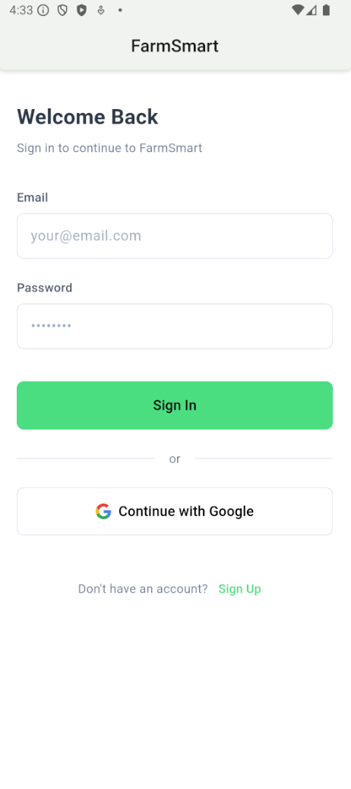
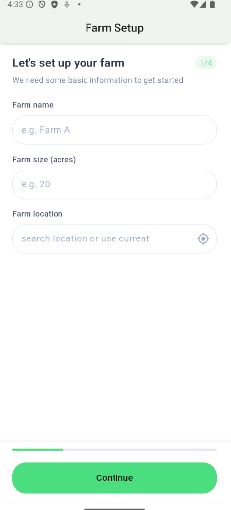
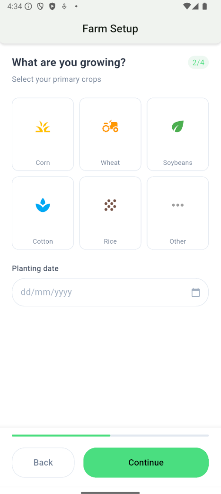
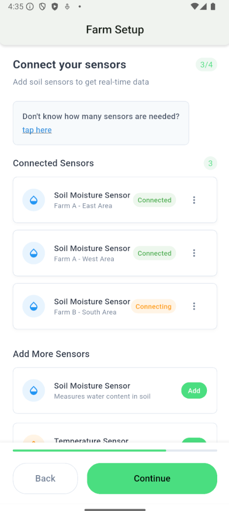
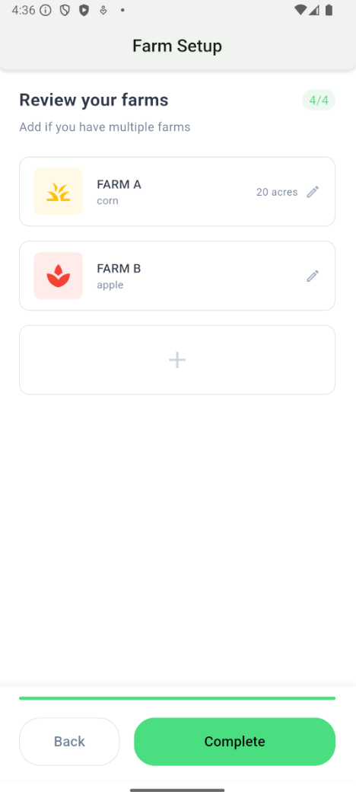
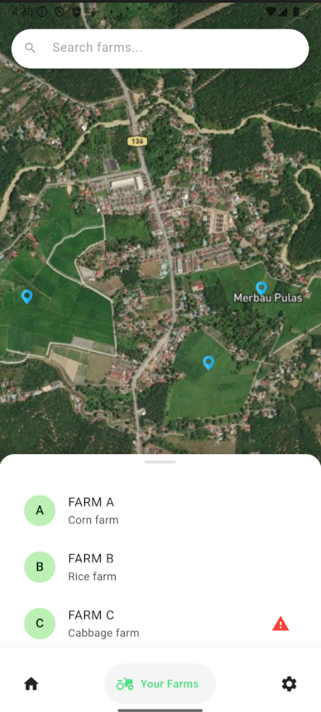
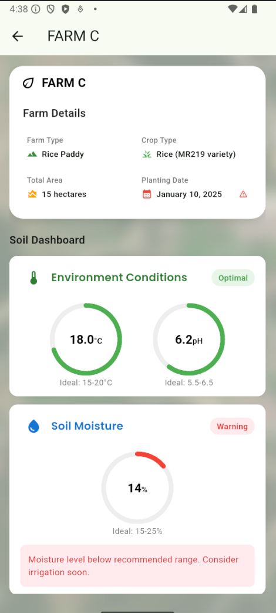
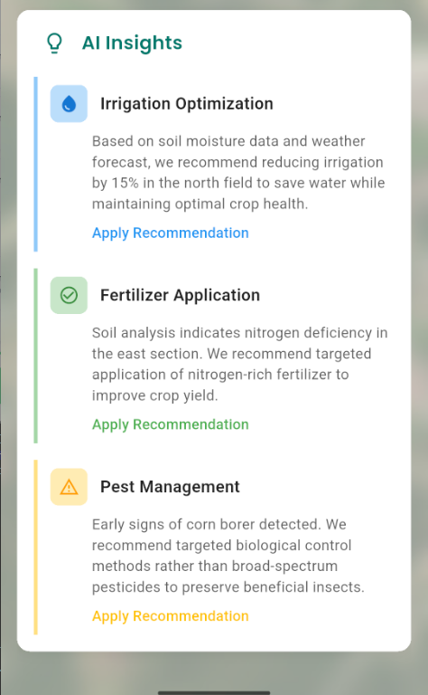

# Crop Master 🌾

A modern Flutter application designed to revolutionize farm management through smart technology and intuitive interfaces. Crop Master helps farmers optimize their crop yields and manage their farms more efficiently.

## 🌟 Features

- **Interactive Farm Map**: Visualize and manage multiple farms with an interactive satellite view
- **Real-time Monitoring**: Track soil conditions, temperature, and moisture levels
- **Smart Task Management**: Organize and track farming activities with an intuitive task system
- **AI-Powered Recommendations**: Get intelligent suggestions for crop management
- **Farm Setup Wizard**: Easy-to-follow setup process for new farms
- **Multi-farm Support**: Manage multiple farms with different crops and conditions
- **Soil Analytics Dashboard**: Monitor pH levels, moisture content, and nitrogen levels
- **Crop Management**: Track planting dates, growth stages, and harvest schedules
- **Weather Integration**: Real-time weather data for better farm planning
- **Mobile-First Design**: Optimized for on-the-go farm management

## 🛠️ Technical Stack

- **Frontend Framework**: Flutter 3.x
- **Programming Language**: Dart 3.x
- **UI Framework**: Material Design 3
- **State Management**: Provider Pattern
- **Navigation**: Custom Navigation System
- **Data Storage**: Local Storage & Cloud Sync
- **Image Processing**: Custom Image Handlers
- **Maps Integration**: Custom Map Implementation
- **Responsive Design**: Adaptive Layout System

## 🏗️ Architecture

The application follows a clean architecture pattern with the following structure:

```
lib/
├── models/         # Data models and business logic
├── screens/        # UI screens and pages
├── widgets/        # Reusable UI components
├── services/       # Business services and API calls
├── utils/          # Utility functions and helpers
└── main.dart       # Application entry point
```

### Key Components:

- **Models**: Handle data structures and business logic
- **Screens**: Implement the main UI flows
- **Widgets**: Provide reusable UI components
- **Services**: Manage data and external integrations
- **Utils**: Offer helper functions and constants

## 👥 Team Members

- Foo Ming Kuang
- Chen Wei Jay Nickolas 
- Lim Xin Rou
- Chu Cheng Qing

## 🚀 Getting Started

### Prerequisites

- Flutter SDK (version 3.x or higher)
- Dart SDK (version 3.x or higher)
- Android Studio / VS Code with Flutter extensions
- Git

### Installation Steps

1. Clone the repository:
   ```bash
   git clone https://github.com/NickolasChen04/cropmaster.git
   cd cropmaster
   ```

2. Install Flutter dependencies:
   ```bash
   flutter pub get
   ```

3. Set up environment variables:
   ```bash
   cp .env.example .env
   # Edit .env with your configuration
   ```

4. Run the application:
   ```bash
   flutter run
   ```

### Development Setup

1. Enable Flutter web support:
   ```bash
   flutter config --enable-web
   ```

2. Run in debug mode:
   ```bash
   flutter run -d chrome
   ```

3. Build for production:
   ```bash
   flutter build web --release
   ```

## 📱 Screenshots

### Authentication
<table>
<tr>
<td></td>
</tr>
</table>

### Home Page
<table>
<tr>
<td></td>
<td></td>
</tr>
</table>

### Farm Setup Flow
<table>
<tr>
<td></td>
<td></td>
</tr>
<tr>
<td></td>
<td></td>
</tr>
</table>

### Farm Management
<table>
<tr>
<td></td>
<td></td>
</tr>
<tr>
<td></td>
</tr>
</table>

## 🔧 Configuration

The application can be configured through the following files:

- `pubspec.yaml`: Dependencies and assets
- `.env`: Environment variables
- `lib/config/`: Application configuration


